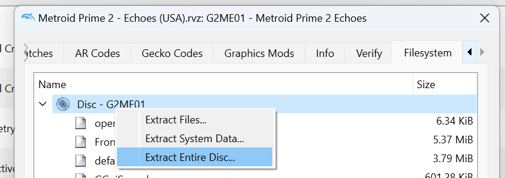

Metroid Prime 2: Echoes [![Build Status]][actions] <!-- ![Code Progress] ![Data Progress] -->
=============

[Build Status]: https://github.com/PrimeDecomp/echoes/actions/workflows/build.yml/badge.svg
[actions]: https://github.com/PrimeDecomp/echoes/actions/workflows/build.yml

<!--
[Code Progress]: https://img.shields.io/endpoint?label=Code&url=https%3A%2F%2Fprogress.deco.mp%2Fdata%2Fechoes%2F0%2Fdol%2F%3Fmode%3Dshield%26measure%3Dcode
[Data Progress]: https://img.shields.io/endpoint?label=Data&url=https%3A%2F%2Fprogress.deco.mp%2Fdata%2Fechoes%2F0%2Fdol%2F%3Fmode%3Dshield%26measure%3Ddata
-->

A decompilation of Metroid Prime 2: Echoes.

This repository builds the following DOLs:

```
6ef9b491d0cc08bc81a124fdedb8bfaec34d0010  build/G2ME01/main.dol
7f24a768f7b1a687adb88e56559ad8637ed80589  build/G2MJ01/main.dol
5a670d5da3d181e86a0df7cf7751c7055eee35fb  build/G2MP01/main.dol
```

<!-- If you'd like to contribute, see [CONTRIBUTING.md](CONTRIBUTING.md). -->

Dependencies
============

Windows:
--------
- Install [ninja](https://github.com/ninja-build/ninja/releases) and add it to `%PATH%`.
- Install [Python](https://www.python.org/downloads/) and add it to `%PATH%`.
  - Also available from the [Windows Store](https://apps.microsoft.com/store/detail/python-311/9NRWMJP3717K).
- (Optional) Run `Add-Exclusion.ps1` (Right click -> "Run with PowerShell") to avoid degraded performance from Windows Defender scans.

macOS:
------
- Install [ninja](https://github.com/ninja-build/ninja/wiki/Pre-built-Ninja-packages):
  ```
  brew install ninja
  ```
- Install [wine-crossover](https://github.com/Gcenx/homebrew-wine):
  ```
  brew install --cask --no-quarantine gcenx/wine/wine-crossover
  ```

Linux:
------
- Install [ninja](https://github.com/ninja-build/ninja/wiki/Pre-built-Ninja-packages).
- Install wine from your package manager.
  - Faster alternative: [WiBo](https://github.com/decompals/WiBo), a minimal 32-bit Windows binary wrapper.  
    Ensure the binary is in `PATH`.

Building
========

- Checkout the repository:
  ```
  git clone https://github.com/PrimeDecomp/echoes.git
  ```
- Download [GC_WII_COMPILERS.zip](https://cdn.discordapp.com/attachments/727918646525165659/1129759991696457728/GC_WII_COMPILERS.zip)
- Extract the _contents_ of the `GC` directory to `tools/mwcc_compiler`.
  - Resulting structure should be (for example) `tools/mwcc_compiler/1.3.2/mwcceppc.exe`
- Using [Dolphin Emulator](https://dolphin-emu.org/), extract your game to `orig/G2ME01`.  

  - To save space, the only necessary files are the following. Any others can be deleted.
    - `sys/main.dol`
    - `files/RelProd/*.rel`
- Configure:
  ```
  python configure.py
  ```
- Build:
  ```
  ninja
  ```
